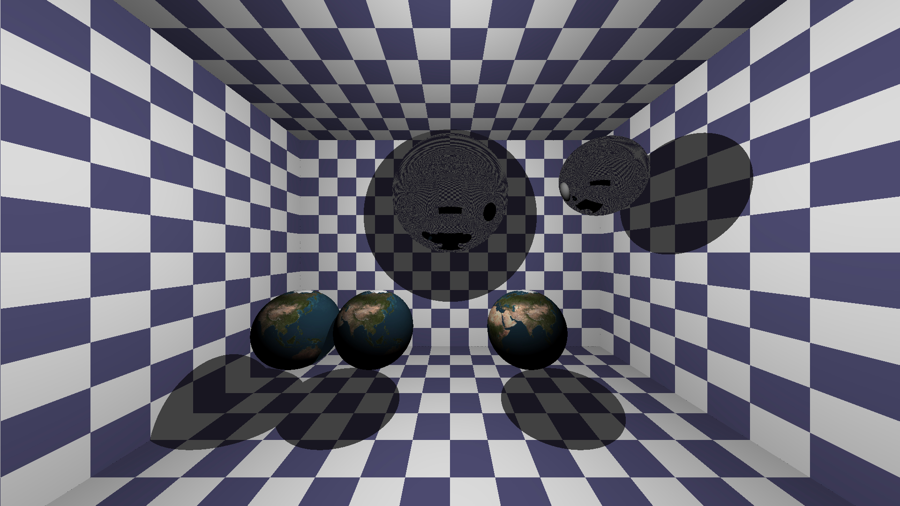

# rtr
Basic Raytracer which renders a very simple scene with texture mapping, reflection, shadow rays. Renders spheres and planes. Uses stb_image.h and stb_image_write.h to load and write images.

Output image:

